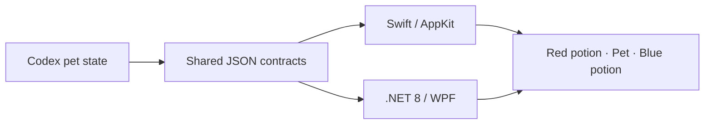

<div align="center">
  
  <h1>Codex Pet HUD</h1>
  <p><strong>Two potions. One pet. Zero distractions.</strong></p>
  <p>A native macOS and Windows HUD that turns five-hour and weekly Codex usage into potions beside your pet.</p>
  <p>
    <a href="docs/i18n/README.ko.md">한국어</a> ·
    <strong>English</strong> ·
    <a href="docs/i18n/README.zh-CN.md">简体中文</a> ·
    <a href="docs/i18n/README.ja.md">日本語</a>
  </p>
  <p>
    
    
    
    
  </p>
  <p><a href="https://himomohi.github.io/codex-pet-hud/"><strong>Website</strong></a> · <a href="https://github.com/himomohi/codex-pet-hud/releases"><strong>Download</strong></a> · <a href="CHANGELOG.md"><strong>Changelog</strong></a></p>
</div>

## Why it feels native

| 🐾 Pet-aware | ⚡ Native on both platforms | 🔒 Quiet by design |
|---|---|---|
| Appears and disappears with the real Codex pet. | Swift/AppKit on macOS and .NET 8/WPF on Windows. | No keyboard hooks, no token logging, no duplicate pet. |

The pet stays centered and clickable. The red potion shows the five-hour window; the blue potion shows the weekly window. Hover to see the reset countdown, or click for details and a manual refresh.

<p align="center"></p>

## Highlights

- Diablo-inspired left and right usage potions without covering the pet
- Live remaining usage, reset countdown, and 20/10/5% threshold alerts
- Scale, spacing, centered placement, offsets, and notification settings
- macOS menu-bar controls and Windows system-tray controls
- Pet-hidden mode pauses HUD rendering and usage refreshes
- Daily cleanup limited to this app's own cache — Codex history and auth stay untouched

## Platform support

| Capability | macOS | Windows |
|---|:---:|:---:|
| Codex pet visibility trigger | ✅ | ✅ |
| Left/right potion HUD | ✅ | ✅ |
| Hover reset countdown | ✅ | ✅ |
| Click details and manual refresh | ✅ | ✅ |
| Threshold alerts and settings | ✅ | ✅ |
| Verified on real hardware | ✅ | 🧪 Preview |

> [!NOTE]
> Windows source and x64/ARM64 publishing are verified, but a real Windows 10/11 UI, DPI, tray, and SmartScreen pass is still required before the first signed release.

## Quick start

Prefer a packaged build? Visit the **[download page](https://himomohi.github.io/codex-pet-hud/#download)** or **[GitHub Releases](https://github.com/himomohi/codex-pet-hud/releases)**. Preview archives include `SHA256SUMS.txt` and may trigger Gatekeeper or SmartScreen because they are not yet notarized or code-signed.

### macOS

Requires macOS 13 or later and Xcode Command Line Tools.

```bash
git clone https://github.com/himomohi/codex-pet-hud.git
cd codex-pet-hud
./install.sh
```

Remove it with `./uninstall.sh`. Add `--logs` to remove runtime logs too.

### Windows

Requires Windows 10/11 and the .NET 8 SDK. Run PowerShell from the repository root:

```powershell
git clone https://github.com/himomohi/codex-pet-hud.git
cd codex-pet-hud
.\install.ps1
```

Remove it with `.\uninstall.ps1`. Add `-Data` to remove settings and alert history too.

## How it works



`electron-avatar-overlay-open == true` plus a valid pet anchor is the only visibility trigger. The app renders only the two potions; it never creates or replaces the Codex pet.

## Project structure

```text
shared/             JSON contracts, fixtures, and settings web assets
platforms/macos/    Swift/AppKit app, LaunchAgent, and shell scripts
platforms/windows/  .NET 8 WPF app, tray UI, and PowerShell scripts
docs/               Architecture, artwork, and translated READMEs
```

Read [the architecture notes](docs/architecture.md) for platform boundaries, secret handling, and the Windows release gate.

## Privacy

- Never reads or records keyboard input
- Reads the existing Codex token only in memory to call ChatGPT's undocumented internal usage endpoint
- Never copies the token into settings or logs
- Cleans only app-owned cache and temporary files
- Stops network refreshes while the Codex pet is hidden

> [!IMPORTANT]
> This is an independent community project, not an official OpenAI product. Its live usage integration depends on an undocumented internal endpoint and may change without notice.

## Contributing

Ideas and focused pull requests are welcome. Please read [CONTRIBUTING.md](CONTRIBUTING.md) and use the issue templates. Security reports should follow [SECURITY.md](SECURITY.md).

Release maintainers should follow the [release handbook](docs/releasing.md). Version tags produce three preview archives plus a verified SHA-256 manifest.

## License

Released under the [MIT License](LICENSE).

<div align="center"><sub>Made for people who keep a tiny coding companion nearby.</sub></div>
