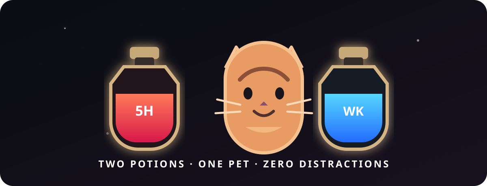

<div align="center">
  
  <h1>Codex Pet HUD</h1>
  <p><strong>2つのポーション、1匹のペット、邪魔はゼロ。</strong></p>
  <p>Codex ペットの両側に、5時間枠と週間枠の使用量をポーションで表示する macOS・Windows ネイティブ HUD。</p>
  <p><a href="README.ko.md">한국어</a> · <a href="../../README.md">English</a> · <a href="README.zh-CN.md">简体中文</a> · <strong>日本語</strong></p>
</div>

## 概要

ペットは中央に残り、そのままクリックできます。左の赤いポーションは5時間枠、右の青いポーションは週間枠の使用量を表示します。ホバーするとリセットまでの残り時間を確認でき、クリックすると詳細表示と手動更新ができます。

| 🐾 ペット連動 | ⚡ 両OSでネイティブ | 🔒 静かでプライバシー重視 |
|---|---|---|
| ペットの表示状態に合わせて自動で隠れ、再表示されます。 | macOS は Swift/AppKit、Windows は .NET 8/WPF。 | キーボード入力を取得せず、トークンを記録せず、別のペットも生成しません。 |

## 主な機能

- ペットを覆わないディアブロ風の左右ポーション
- リアルタイム残量、リセットカウントダウン、20/10/5%通知
- サイズ・間隔・中央配置・位置オフセット設定
- macOS メニューバーと Windows システムトレイ
- ペット非表示中は描画とネットワーク更新を停止
- Codex の履歴や認証に触れないアプリ専用キャッシュ整理

## 対応プラットフォーム

| 機能 | macOS | Windows |
|---|:---:|:---:|
| ペット表示状態との連動 | ✅ | ✅ |
| 左右ポーションとホバーカウントダウン | ✅ | ✅ |
| 詳細・通知・設定 | ✅ | ✅ |
| 実機検証 | ✅ | 🧪 プレビュー |

> Windows の x64/ARM64 ビルドは検証済みですが、初回署名リリース前に実機の Windows 10/11 で UI・DPI・トレイ・SmartScreen の確認が必要です。

## インストール

### macOS

```bash
git clone https://github.com/himomohi/codex-pet-hud.git
cd codex-pet-hud
./install.sh
```

削除：`./uninstall.sh` · ログも削除：`./uninstall.sh --logs`

### Windows

```powershell
git clone https://github.com/himomohi/codex-pet-hud.git
cd codex-pet-hud
.\install.ps1
```

削除：`.\uninstall.ps1` · 設定も削除：`.\uninstall.ps1 -Data`

## プライバシー

- キーボード入力を読み取り・記録しません。
- Codex トークンは文書化されていない ChatGPT 内部使用量 API の呼び出し時だけメモリ上で扱い、設定やログへコピーしません。
- 本アプリ所有のキャッシュと一時ファイルだけを削除します。
- ペット非表示中はネットワーク更新を停止します。

> 本プロジェクトは OpenAI の公式製品ではなく、独立したコミュニティプロジェクトです。リアルタイム使用量連携は文書化されていない内部 API に依存しており、予告なく変更される可能性があります。

構造とセキュリティ境界は[アーキテクチャ文書](../architecture.md)をご覧ください。貢献方法は [CONTRIBUTING.md](../../CONTRIBUTING.md)、ライセンスは [MIT](../../LICENSE) です。
